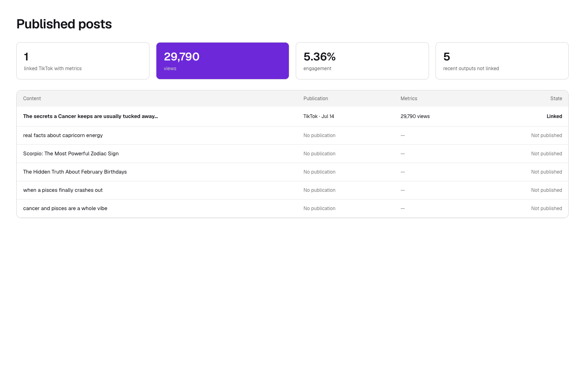
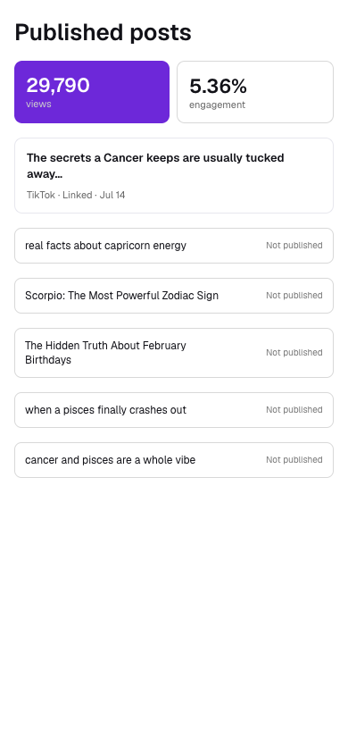

Route: `/app?view=automations&automation=<id>`

## Layout

Owner: `components/realfarm/automation-settings/tiktok-publication-import-panel.tsx`.

Published Posts is not a Home section or an independently addressable page.
It is a navigation panel inside an opened slideshow automation. The route above
opens the automation workspace at Overview; the user then selects Published
Posts. Video, AI UGC, X, and Threads automations do not expose this panel.

The shipped panel is titled Published TikTok posts. It begins with a multiline
field for TikTok photo-post URLs and an Inspect posts action. While TikTok is
being inspected, the panel shows progress or a terminal error. Inspection
results appear as cards. Each card shows the first photo when available, hook
text, caption, photo count, publication date and time, and a link to the public
TikTok post. A card already attributed to a local output carries a Linked
badge. An unlinked card instead provides candidate local slideshow matches
with confidence values and a recovery choice that reconstructs a historical
slideshow from the TikTok images and visible text.

Desktop keeps the automation section navigation in a left rail and lays out
each result card with its preview beside its details. Mobile uses a sticky bar
whose section control opens the automation navigation in a bottom sheet; the
result card content stacks at narrow widths.

The Paper exports above show a proposed standalone summary with aggregate
views, engagement, and table rows labeled Linked or Not published. That summary
is not mounted by the current application. The shared
`PublicationStatusControl` does label generated video cards elsewhere as
Published, Scheduled, or Not published, but it is not used by this panel. The
26-week posting activity graph appears on Home, not in Published Posts.

## Interactions

Inspect posts starts a read-only import and polls until TikTok photo slides and
visible text are available for matching. For every unlinked result, the user
can accept a candidate run or choose recovery. The account selector chooses a
connected TikTok publishing account. Link published posts records the selected
attributions, refreshes the automation's run history, and changes successfully
attributed cards to Linked. The action is unavailable when there is no
connected TikTok account or no pending result.

Opening the public-post link leaves LumenClip in a new browser tab. Switching
to Published Posts through the automation navigation is UI-only and does not
change the route.

## MCP coverage

Yes. `lumenclip_tiktok_import_start` starts inspection,
`lumenclip_tiktok_import_preview` returns candidate matches,
`lumenclip_accounts_list` lists connected publishing accounts, and
`lumenclip_tiktok_publications_link` records confirmed attributions and can
recover a missing historical output. Selecting the panel itself is UI
navigation.
