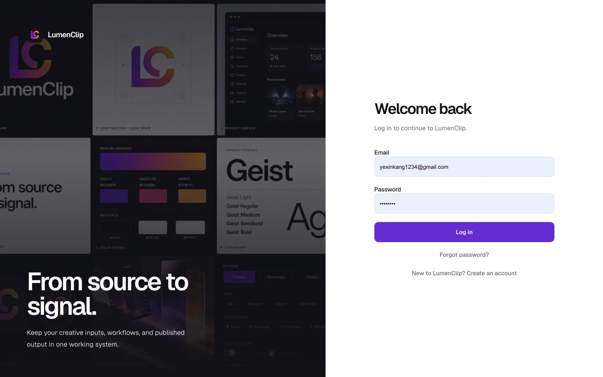

Route: `/login`, `/reset-password`, `/verify-email`, and `/team-invite`

Owner: `components/auth-form.tsx`, `components/password-reset-card.tsx`,
`components/email-verification-card.tsx`, and `components/team-invite-card.tsx`.

## Layout

### Login

Desktop `/login` divides the viewport between a branded image panel and a form.
The form switches between Log in and Create your workspace without changing the
route; registration adds a Name field. On smaller screens the image panel is
hidden and the brand link and form occupy a single centered column. The image
above is a production capture from July 29, 2026.

### Password reset

`/reset-password` centers a branded card. Without recovery parameters it asks
for an email address. With both `userId` and `secret`, it instead asks for a new
password and confirmation. The same card renders request-sent, completed, and
error states.

### Email verification

`/verify-email` centers a branded status card. A link containing `userId` and
`secret` begins in a checking state and then shows success or failure. Without
those parameters the card asks the user to check their inbox and offers a resend
action; `sent=0` explains that the first message could not be sent.

### Team invitation

`/team-invite` centers a card backed by the current session and the `teamId`,
`membershipId`, `userId`, and `secret` query parameters. A logged-out visitor is
offered Log in and Create account. A signed-in visitor with all four fields sees
the accepting state followed by success or an error; an incomplete signed-in
link is rejected.

## Interactions

Submitting the login or registration form calls the matching auth endpoint.
Successful login uses the `next` query value when present and otherwise opens
`/app`; an already signed-in visitor to `/login` is redirected to `/app`.
Registration that requires verification continues to `/verify-email` with the
initial delivery result.

Forgot password opens the request card. After a request, the card always gives
the same account-neutral inbox message. A valid recovery link accepts matching
new passwords and then links back to login. Verification links confirm
automatically, while the waiting and error states can request a fresh email.

The invitation card preserves its full query string in the login or registration
`next` value. Once authentication returns to that URL, acceptance begins
automatically. A successful acceptance offers a link to `/app`.

## MCP coverage

Partial. `lumenclip_workspace_members_list` can inspect accepted members and
pending invitations, but login, registration, recovery, verification, and
invitation acceptance have no registered tools.
