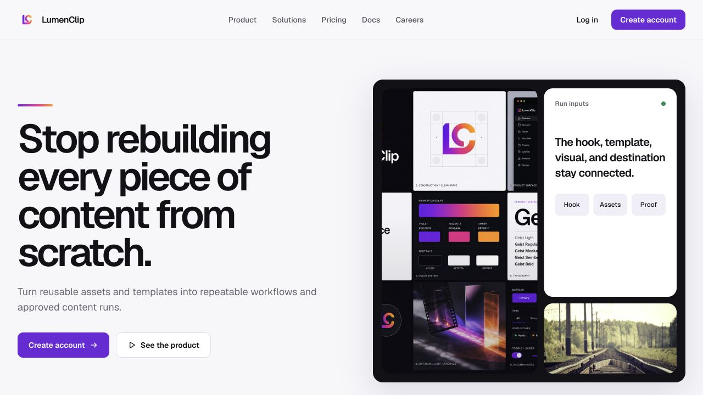
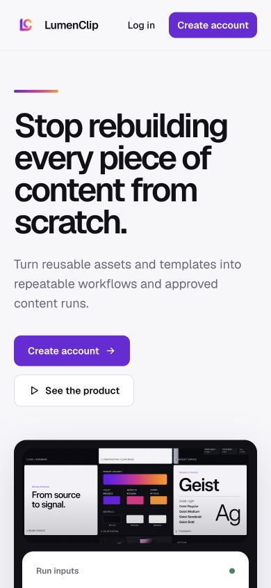
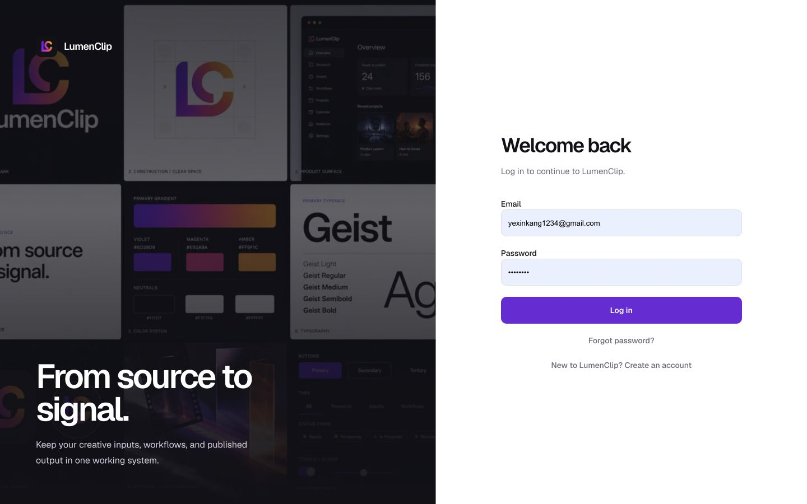

Route: `/`

Related logged-out routes: `/docs`, `/privacy`, `/terms`, `/login`, and `/sign-up`

## Layout

On desktop, the marketing routes share a sticky LumenClip header with a Docs link plus Log in and Create account actions. The landing page begins with a two-column hero and product collage, then continues through its marketing sections, a closing call to action, and the shared footer. Privacy and Terms use narrower reading columns.

The desktop login and sign-up routes divide the viewport between a branded image panel and Clerk's account component. Clerk presents verification, recovery, and required session tasks within those routes.

| Route          | Visible purpose                                   |
| -------------- | ------------------------------------------------- |
| `/`            | Marketing overview and primary conversion actions |
| `/privacy`     | Private-beta account and workspace data summary   |
| `/terms`       | Private-beta product-use expectations             |
| `/login`       | Clerk sign-in, recovery, and session tasks        |
| `/sign-up`     | Clerk account creation and verification           |

On mobile, marketing content becomes a single vertical flow and multi-column cards stack. The current header keeps the brand and a menu action; opening it displays a full-screen navigation menu with the public destinations followed by Create account and Log in. The menu locks background scrolling, closes on Escape or its close action, and closes when a destination is selected. Login hides the desktop image panel and places the brand link and form in one centered column. No mobile login screenshot exists.

## Interactions

Marketing navigation and calls to action move among public routes or open Clerk
sign-in/sign-up controls. Dedicated `/login` and `/sign-up` pages preserve safe
same-origin `next` destinations. Clerk owns recovery and verification.

## MCP coverage

No. Marketing navigation and Clerk authentication are browser and session flows
with no tools in `lib/mcp/`.
