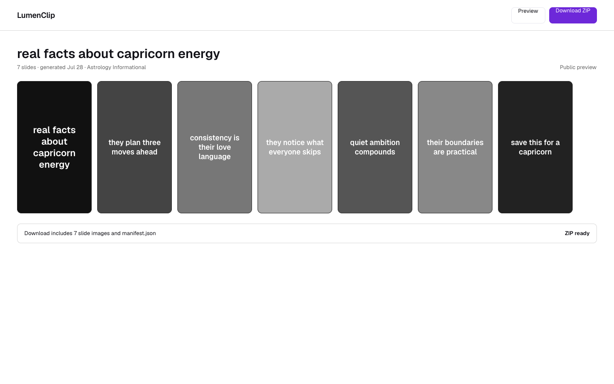
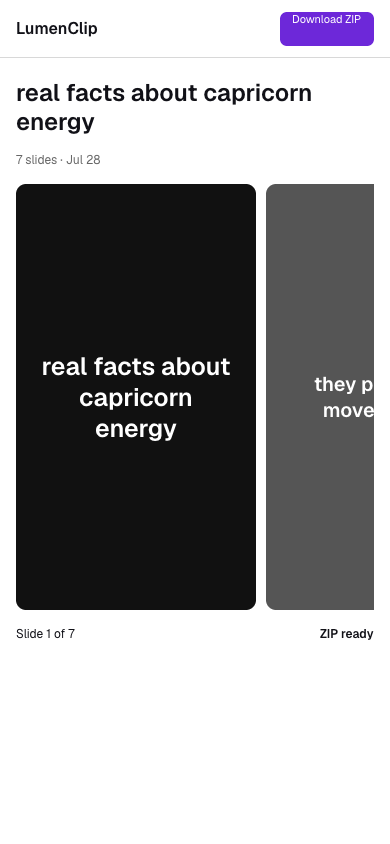

Route: `/share/slideshows/[id]?token=[signed-token]`

Owner: `components/realfarm/public-slideshow-share.tsx`.

## Layout

The route is unauthenticated but not open by ID alone. The server requires a
signed, unexpired token whose output ID matches the path; a missing, invalid,
expired, or mismatched token renders Not Found.

The shipped page places a LumenClip delivery label and slideshow title above a
metadata card. The card repeats the title with a Copy title action, combines the
description and hashtags with a second copy action, and provides Download all
slides (.zip). An empty description and hashtag set renders an explicit empty
message and disables its copy action.

Rendered slides follow in a responsive image grid with an image count. The grid
uses two columns by default, three from `sm`, and four from `lg`; every image
keeps its original aspect ratio. Each image request carries the same share token.

The images above are Paper design-file exports from August 1, 2026, not captures
of the current component. Their horizontal preview strip and compact download
header are concept treatments; the metadata card and responsive grid described
here are the shipped implementation.

## Interactions

Copy title writes the title to the browser clipboard. Copy description +
hashtags writes the combined text and briefly changes the corresponding icon to
confirm success. Download all slides follows a token-bearing public API URL and
downloads a ZIP archive. The page does not edit or publish the output.

## MCP coverage

Yes. `lumenclip_output_get` retrieves the caller-owned slideshow and returns its
signed public preview and direct-download URLs. `lumenclip_automation_run` also
returns those delivery URLs for a completed slideshow run. Clipboard actions and
opening the public page are browser-only.
