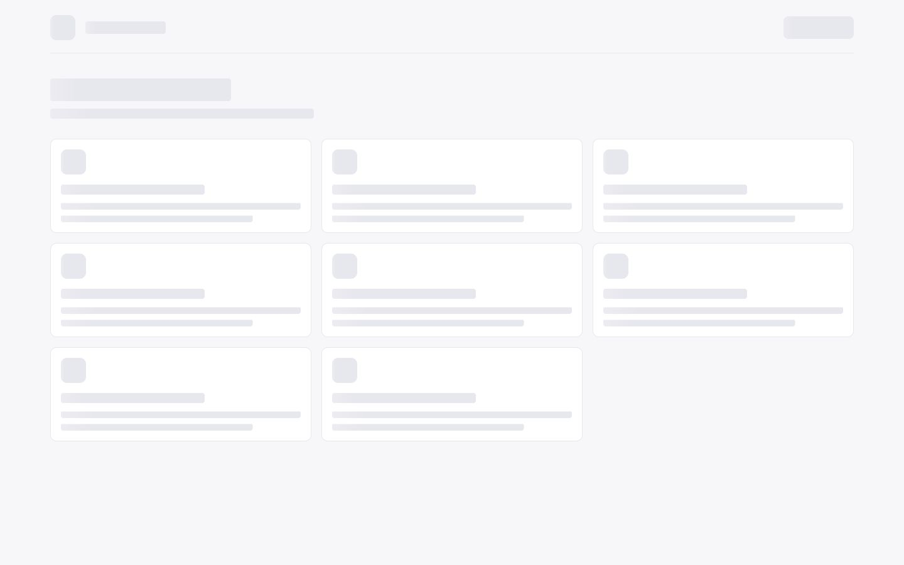
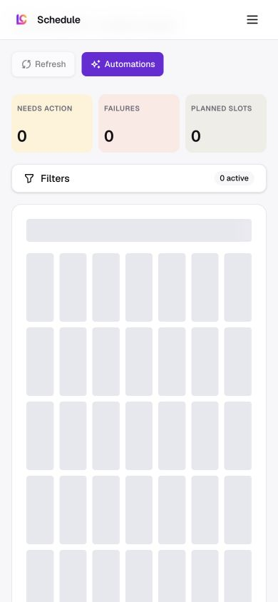

Route: `/app?view=schedule`

## Layout

Owner: `components/realfarm/content-calendar/content-calendar-view.tsx`.

The page places Refresh and Automations beside the Content calendar heading,
then shows filtered counts for needs action, failures, and planned slots. The
calendar combines projected automation slots, queued or processing automation
jobs, locally tracked publications, and live PostFast scheduled or published
posts. These sources are deduplicated into lifecycle states for planned,
generating, generation failed, needs action, draft, failed, scheduled, and
published content.

Automation posting mode determines the materialized publication state. Auto
sends generated content to PostFast for its scheduled slot, Review records it
as ready for approval, and Manual records it as awaiting manual posting. Review
and Manual items both appear as needs action.

Desktop keeps account, platform, lifecycle, automation, and source filters in a
wrapping toolbar. Mobile replaces that toolbar with one Filters action that
opens a scrollable bottom sheet. The calendar itself retains month and week
views on both layouts; its toolbar becomes a vertical stack below 640 pixels.
Each item shows a provider mark, time, and automation or item title. Selecting
an item opens a modal with its status, preview when available, caption, source,
timezone, timestamps, publishing targets, and error details.

## Interactions

The calendar has no form for creating a post. A manually composed scheduled
item is created through [Compose](/docs/ui/compose/compose) by choosing a future
time and selecting Schedule. Automation cadence is configured separately in
[Automation schedule](/docs/ui/automations/schedule); the Automations action
opens that workspace rather than duplicating its controls here.

Month, week, today, previous, and next controls change the requested date
range. Filters narrow both the events and summary counts and persist in browser
storage under `lumenclip:calendar-filters:v1`. Refresh reloads the visible
range. A locally tracked PostFast item with a stored content snapshot can be
dragged to a future time to reschedule it. Remote-only PostFast items are not
draggable. Scheduled items can be cancelled from their detail modal, failed
generation jobs can expose Retry generation, and available links open
generated content or the live post.

## MCP coverage

Partial. `lumenclip_schedule_get` returns the unified schedule report, including
projected slots and calendar lifecycle items. `lumenclip_automation_update` can
change an automation schedule, and `lumenclip_output_publish` can schedule a
ready output. Drag-rescheduling, cancelling a scheduled PostFast item, and
retrying a failed calendar job have no matching registered tools.
