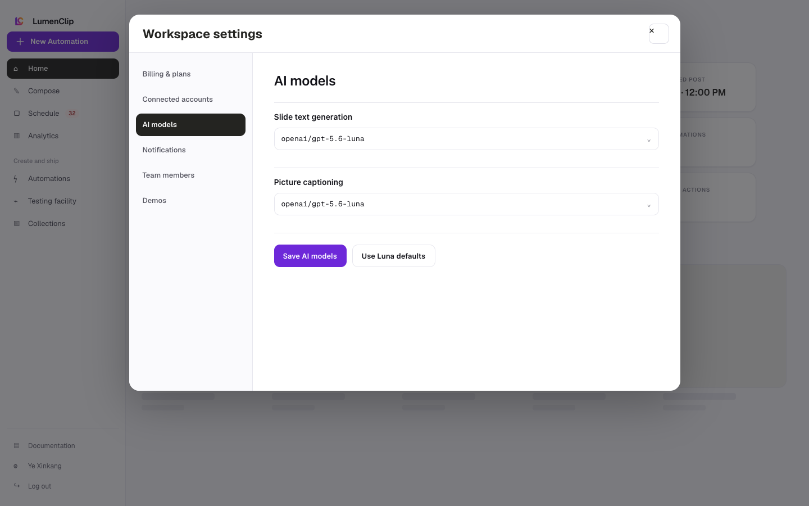
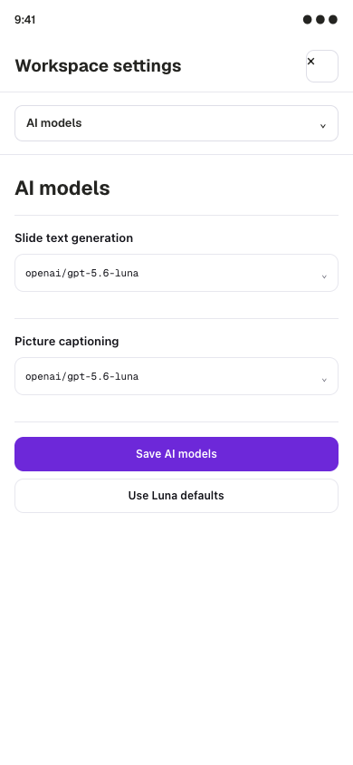

Route: `/app` (open Workspace settings, then select AI models; the panel has no direct URL state)

Owner: `components/realfarm/user-settings-modal.tsx`.

## Layout

AI models is one panel in the Workspace settings modal. At the `md` breakpoint
and above, the modal places its six-button navigation rail to the left of a
scrollable content panel. On narrower screens the navigation buttons and content
stack. The panel is reached by opening Workspace settings from `/app` and then
selecting AI models; neither the open modal nor its selected panel is stored in
the URL.

The panel contains text inputs for Slide text generation and Picture captioning.
Each input is connected to a datalist of recommended OpenRouter model IDs, so a
browser can offer suggestions while still allowing an arbitrary valid model ID.
Loading uses a two-row skeleton, and a failed load replaces the fields with an
error and Try again action.

The images above are Paper design-file exports from August 1, 2026. They are
reference imagery, not running-app captures. The current fields are editable
text inputs with suggestions rather than closed select menus.

## Interactions

Editing either model ID creates a local draft. Save AI models is enabled only
when that draft differs from the loaded settings and persists both IDs together.
Use Luna defaults changes both draft fields to `openai/gpt-5.6-luna`; it does not
save the change automatically. The panel reports save success or failure inline.

Closing Workspace settings or selecting another settings panel while the draft
is dirty opens the shared discard confirmation. Opening the modal and selecting
AI models are UI navigation.

## MCP coverage

No. The registry has no tool for reading or updating workspace generation-model
settings.
