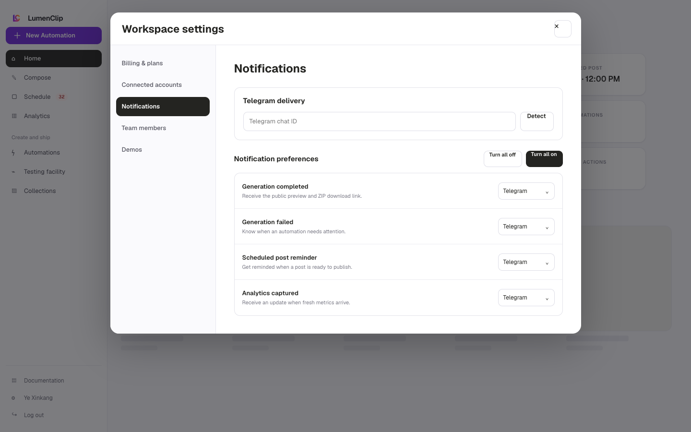
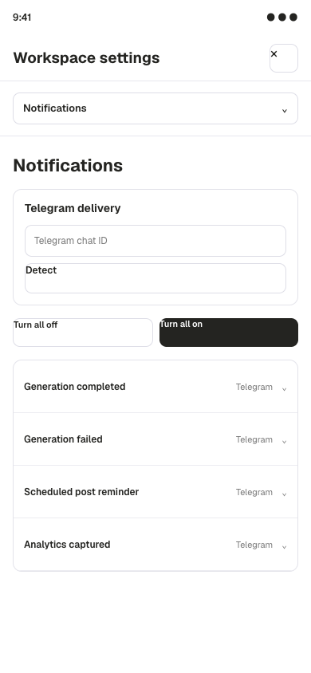

Route: `/app` (open Workspace settings, then select Notifications; the panel has no direct URL state)

Owner: `components/realfarm/user-settings-modal.tsx`.

## Layout

Workspace settings opens as a modal over the authenticated workspace. At the
`md` breakpoint and above, a 220px navigation rail sits beside a scrollable
panel. On narrower screens the same six navigation buttons sit above the panel
instead of becoming a select control. Notifications is not the initial panel;
the modal initially opens Billing & plans.

The Notifications panel shows loading and retry states before rendering its
controls. Telegram delivery appears when a workspace or custom bot is
configured, or when at least one saved event already uses Telegram. It contains
the chat or channel ID, chat detection, and an expandable custom bot-token
field. Saved bot tokens are not returned to the browser.

The event list covers Generation complete, Ready to post, Scheduled to post,
Respond to comments, Publishing failed, and Generation failed. Each row chooses
Off or Telegram. Respond to comments also exposes one-day and three-day timing
buttons. Save and Telegram test actions follow the list.

The images above are Paper design-file exports from August 1, 2026. They are
reference imagery rather than running-app captures; the current component
behavior described here takes precedence, including the six-event list and the
mobile button navigation.

## Interactions

The user can detect a recent Telegram chat after sending `/start` to the bot,
enter a chat or channel ID directly, or expand Use a different bot to supply a
replacement token. Turn all on assigns Telegram to every event when a bot is
available, while Turn all off assigns Off. Event rows can be changed
individually, and the follow-up timing buttons are disabled while their event is
off.

Save notifications persists the draft and configures the Telegram webhook on a
best-effort basis when Telegram is in use. Send test becomes available when a
bot and destination are present. Closing the modal or changing settings tabs
with an unsaved notification draft opens the shared discard confirmation.
Opening the modal, selecting Notifications, and closing it are UI navigation.

## MCP coverage

No. The registry has no tool for reading or changing reminder settings,
detecting a Telegram chat, or sending the settings test notification.
