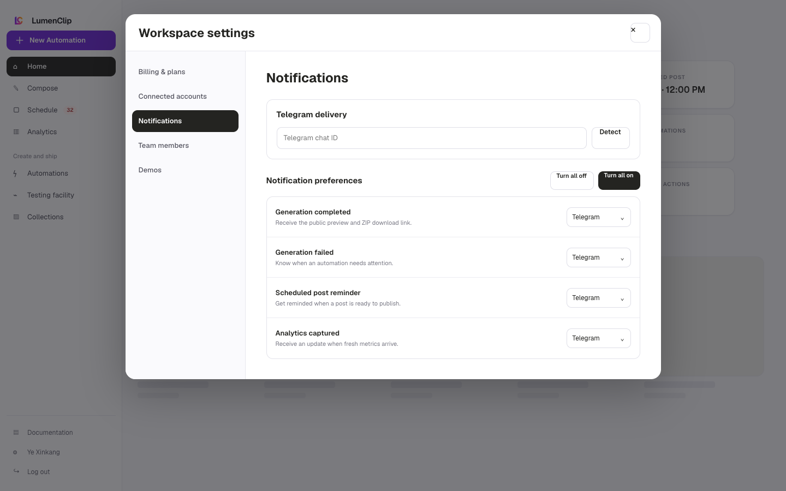
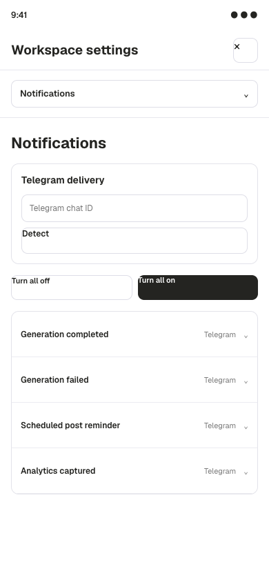

Route: `/app` (open Workspace settings, then select Notifications; the panel has no direct URL state)

Owner: `components/realfarm/user-settings-modal.tsx`.

## Layout

Workspace settings opens as a modal over the authenticated workspace. At the
`md` breakpoint and above, a 220px navigation rail sits beside a scrollable
panel. On narrower screens the navigation buttons sit above the panel.
Connected accounts is the initial panel.

The Notifications panel shows loading and retry states before rendering its
controls. Notifications are delivered in the app only; there is no external
channel. The event list covers Slideshow rendered, Ready to post, Scheduled to
post, Respond to comments, and Publishing failed. Each row chooses Off or In
app. Respond to comments also exposes one-day and three-day timing buttons.

The images above predate the in-app-only change and show the retired Telegram
controls; the behavior described here takes precedence.

## Interactions

Turn all on assigns In app to every event, while Turn all off assigns Off.
Event rows can be changed individually, and the follow-up timing buttons are
disabled while their event is off. Save notifications persists the draft.
Closing the modal or changing settings tabs with an unsaved notification draft
opens the shared discard confirmation.

## MCP coverage

No. The registry has no tool for reading or changing notification settings.
