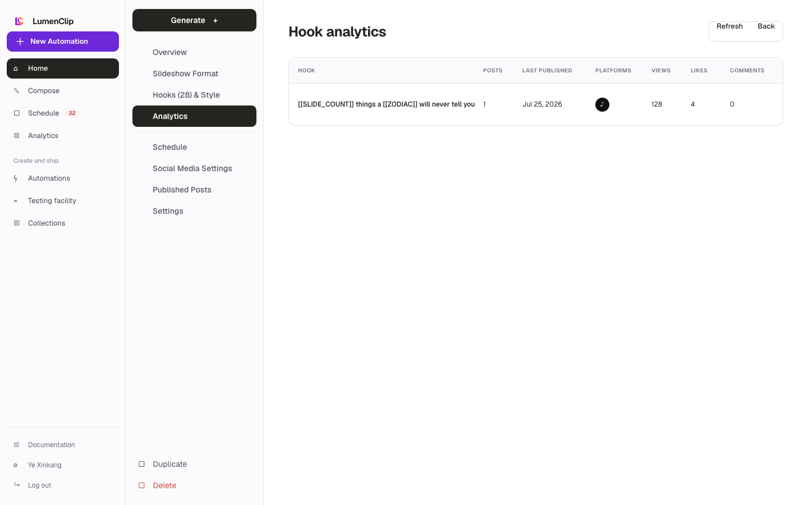
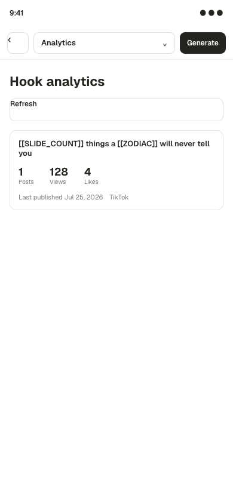

Route: `/app?view=templates&template=<id>`

## Layout

Owner: `components/realfarm/automation-settings/hook-analytics-panel.tsx`.

The Analytics section renders a refresh action and a table of hooks that have
confirmed publication attribution. Each row contains hook text, disabled state,
published post count, last publication date, platforms, views, likes, comments,
shares, saves, and engagement rate. Unknown metrics use a plain dash.

The table keeps a minimum width and scrolls horizontally inside its bordered
container on narrow screens. Loading, failure, and no-used-hooks states replace
the table with a centered status panel. A hook enters the report only after
PostFast confirms publication or an output is marked published and linked to
its public post.

## Interactions

Refresh reloads the current template's attribution and metrics and disables
itself while the request is running. This panel is read-only; hook changes occur
in Hooks and Style, and publication linking occurs in the output or Published
Posts flows.

## MCP coverage

Yes. `lumenclip_hook_performance` returns hook-attributed publication counts and
performance metrics. Refreshing or switching to the Analytics section is UI
navigation.
