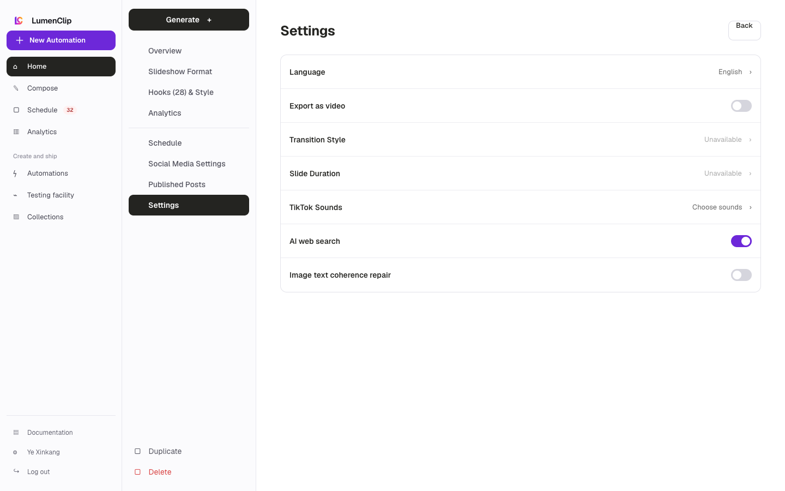
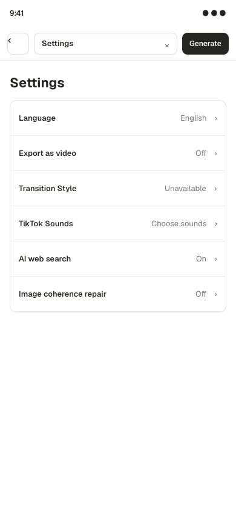

Route: `/app?view=templates&template=<id>`

## Layout

Owner: `components/realfarm/automation-settings/general-settings.tsx` inside
`components/realfarm/automation-settings/drawer.tsx`.

The desktop editor places Generate and its section navigation in a 246 pixel
left rail, with Duplicate and Delete template at the bottom. The Settings
panel uses labeled rows for generation language and AI web search. Slideshow
templates also expose Export as video. Enabling that setting activates
transition style, slide duration, and sound selection. Video templates omit
those slideshow export controls because their output is already video.

Mobile replaces the rail with a sticky Back control, current-section menu, and
Generate action. The menu opens the same editor sections in a bottom sheet.
Settings rows stack their labels above controls, and Cancel and Save Changes
share the available width.

Opening Format replaces the desktop navigation rail with format controls and a
live preview. Slideshow controls are split into Hook, Content, and CTA sections;
video templates expose the media sources, music, segments, and text elements
their renderer supports. On mobile, slideshow formatting separates Design and
Preview into explicit views, while video controls and preview flow vertically.

## Interactions

Language changes generated slide text or video copy. Export as video switches
the slideshow publish output to a video file; transition, duration, and sound
then configure that export. AI web search allows the generation model to search
for current facts when it decides the output needs them.

Settings remain a local draft until Save Changes persists the complete schema
and returns to Overview. Cancel discards the draft. Leaving with an unsaved name
or schema change enters the dirty-state confirmation. Duplicate creates a new
copy of the template schema and opens it, while Delete template removes the
selected template. Generate refuses to run while settings changes remain
unsaved, validates the required media inputs, and then returns to Overview with
the in-progress or completed output.

## MCP coverage

Yes for the saved settings through `lumenclip_template_get` and
`lumenclip_template_schema_update`. `lumenclip_template_clone` duplicates an
template and `lumenclip_template_delete` removes one. The editor menu and
dirty-state confirmation are UI-only.
