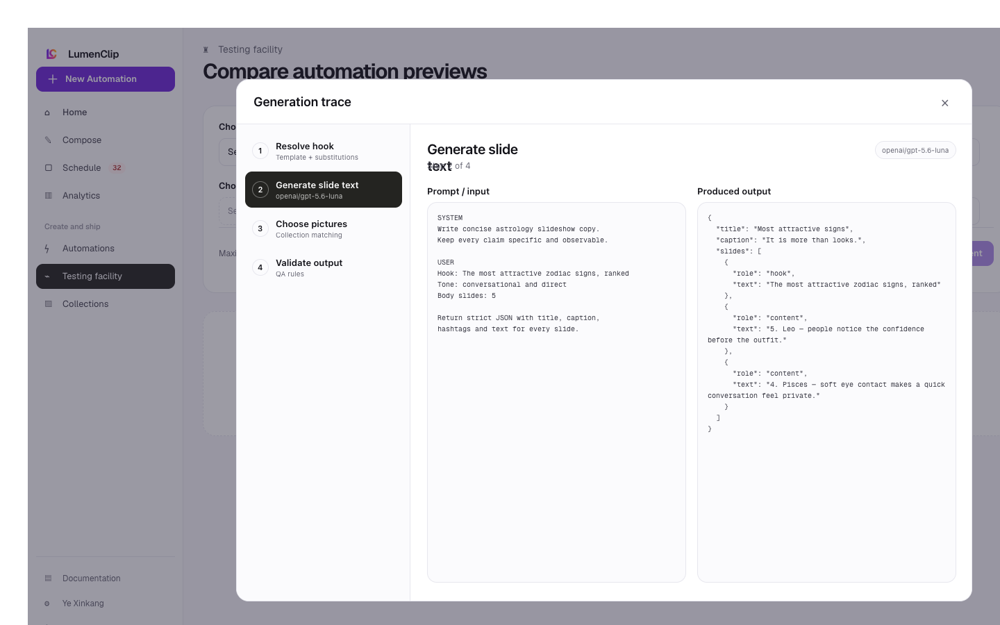
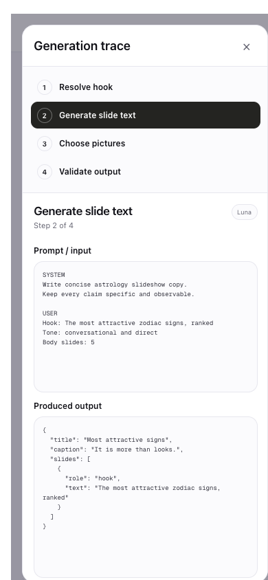

Route: `/app/testing` (panel state; no separate route)

## Layout

No LumenClip component owns this panel. The nominal route is
`app/app/testing/page.tsx`, which redirects to LumenLab without rendering a
local result grid or trace.

The images above are Paper design-file exports from 1 August 2026, traced from
the removed testing UI rather than captured from a shipped surface. They depict
a Generation trace dialog with Resolve hook, Generate slide text, Choose
pictures, and Validate output steps. The desktop reference places the step list
beside prompt and output panes; the mobile reference stacks the step list above
those panes. This description does not assert that the external LumenLab
destination implements the panel.

## Interactions

There is no local result cell to select and no trace dialog to open, close, or
step through. The retained experiment operation returns a plan and QA report for
each successful cell, plus per-cell warnings or errors, but `/app/testing`
redirects without presenting those fields.

## MCP coverage

Yes for the underlying cell data via `lumenclip_automation_experiment_run`,
which returns each cell's variant, generation plan, QA report, warnings, and
error. Opening a trace panel or switching its visible step would be UI
navigation and is not expected to have a separate MCP tool.
