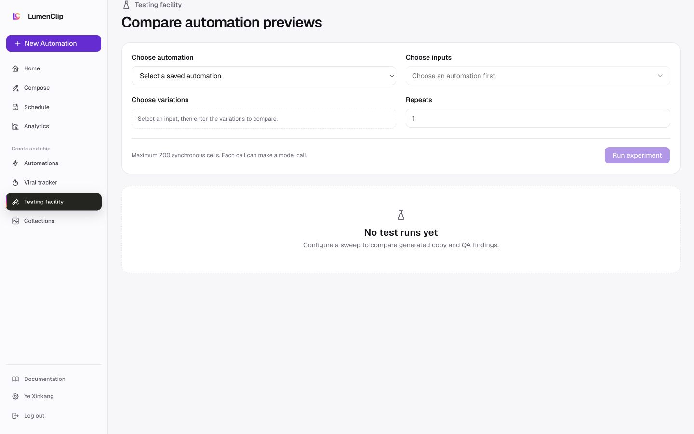

Route: `/app/testing`

## Layout

Owner: `app/app/testing/page.tsx`.

The current route renders no CFarm testing layout. It performs a server redirect
to `https://lumenlab-one.vercel.app/testing`, and Testing facility is no longer
present in the CFarm desktop or mobile workspace navigation. The production
captures above show the comparison form that existed on July 29, before the
August 1 handoff; they are historical reference imagery rather than the current
local screen.

No current CFarm testing component remains in which the raw TikHub environment
error flagged by the July audit could render. The destination application's
current error presentation is outside this repository and is not asserted here.

## Interactions

Opening `/app/testing` leaves the CFarm application for the LumenLab testing
URL. CFarm does not currently mount controls for choosing an automation,
selecting dimensions, setting repeats, running a sweep, or opening a result
trace on this route.

The retained backend experiment engine accepts one saved slideshow automation,
a Cartesian set of hook, variable, tone, model, collection, or content-direction
variations, and 1 to 20 repeats. It previews without persisting or publishing,
caps synchronous work at 200 cells, and returns each cell's variant, generation
plan, QA report, warnings, and error when one occurs. That engine is available
to MCP but is not mounted as a current CFarm page.

## MCP coverage

Yes for the underlying experiment operation via
`lumenclip_automation_experiment_dimensions` and
`lumenclip_automation_experiment_run`. Following the browser redirect and
opening controls in another application are UI navigation.
