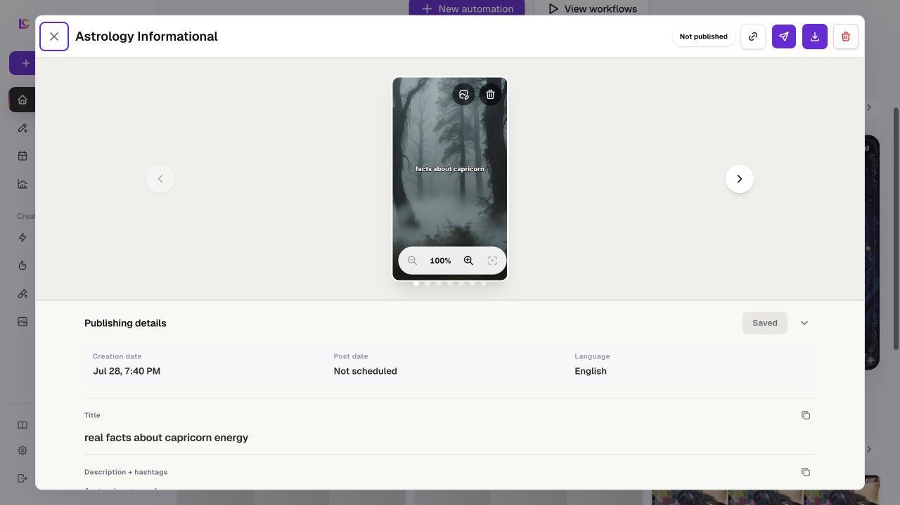

Route: Modal state from `/app?view=home`, `/app?view=automations`, and `/app/collections/[id]`.

## Layout

Owners: `components/realfarm/image-viewer-modal.tsx` and
`components/realfarm/slideshow-viewer-modal.tsx`.

The collection image viewer fills the viewport with a dark overlay. Close and
previous/next controls surround one contained image. Its caption, position in
the current image set, and an image-action panel appear below the preview. The
panel switches between prompt-based editing and 2x or 4x upscaling and includes
the registered image-model choices from the application model registry.

On desktop, the slideshow viewer is a large modal with a header, one centered
slide stage, position dots, and a Publishing details panel below the stage. The
header contains Close, the output title, caller-supplied publication status and
actions, a Workflow link for persisted generated slideshows, PNG export, and
optional generation-debug and whole-output deletion controls. The Workflow link
opens the signed public trace for that exact output. The details panel can show
creation date, post date, language, title, description, and hashtags.

On mobile, the slideshow viewer fills the viewport. Previous and next arrows
overlay the slide, publication status moves into the stage, and Publishing
details opens as a constrained scrolling section beneath it. Edit controls are
omitted whenever the parent does not supply the corresponding callback, so
template examples and other read-only uses share the viewer without exposing
unsupported changes.

The generated automation video viewer uses a narrower modal whose desktop
layout places a vertical player beside status, timing, duration, creation date,
type, language, publishing copy, selected-account status, and any run error. A
running export shows its current render stage instead of the player, and a run
without a video shows an empty state. On mobile the columns become one scrolling
flow with the player before the details. The persisted-export viewer uses the
same player and copy-field pattern with fewer run details. No mobile screenshot
is currently available for these viewer states.

## Interactions

The collection image viewer moves between images without wrapping at either
end. An editable collection caption changes through the parent collection
surface. Image edit submits a non-empty prompt, while upscale submits the
selected factor; either successful action replaces the displayed collection
image with the returned asset.

The slideshow viewer moves with the previous and next buttons or any position
dot. The stage supports wheel and button zoom, double-click zoom, pointer drag,
two-pointer pinch, keyboard plus and minus zoom, arrow-key panning, and reset
with `0` or Escape. Export downloads the rendered slides as a PNG ZIP, and copy
actions place the title or combined description and hashtags on the clipboard.

For an editable generated slideshow, the user can save title, description, and
hashtag changes, choose an unused image from the automation's selected photo
collections and rerender the active slide, or delete a slide after
confirmation. The final remaining slide cannot be deleted. Closing with
unsaved metadata invokes a discard confirmation. Whole-output deletion is
shown only when the parent marks the completed output eligible, and publication
or scheduling actions are supplied by the generated-output wrapper.

Generated videos use native playback controls and read duration from loaded
media metadata when available. Their title, description, and hashtags are
copyable publishing fields. Completed video deletion is available only when
the output is neither scheduled nor published. The viewers consume persisted
rendered media; authoritative slideshow and video render configuration remains
in the shared renderer and export paths.

## MCP coverage

Partial. `lumenclip_assets_list` retrieves collection assets, while
`lumenclip_outputs_list` and `lumenclip_output_get` retrieve generated output
data. `lumenclip_workflow_trace_get` returns all 16 slideshow-generation stages
with their input and output, and `lumenclip_workflow_stage_get` addresses one
stage by ID. `lumenclip_output_publish` publishes or schedules an eligible
output, and `lumenclip_output_delete` deletes an unpublished output. Viewer navigation,
zoom and pan, clipboard copy, PNG export, collection-image caption edits,
image-model edit or upscale, slideshow metadata edits, slide-image replacement,
and individual slide deletion remain UI-only.
